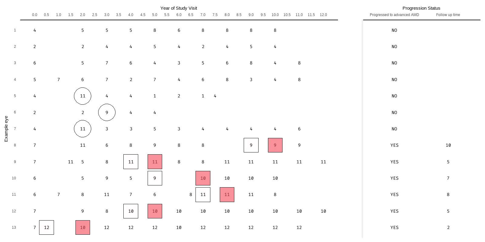

# AREDS Severity Scale Visualization

> A custom visualization I developed to visualize
> some issues in AREDS 1 severity scale 
> that affected our analysis.

## REPO OBJECTIVE

This repo is a snippet for the R code to create the visualization in Supplemental Figure 1 in: <b>Seddon et al. Rare and Common Genetic Variants, Smoking, and Body Mass Index: Progression and Earlier Age of Developing Advanced Age-Related Macular Degeneration (2020).</b> 
[(PUBMED LINK)](https://pubmed.ncbi.nlm.nih.gov/33369641/)

---

## FULL STORY

See [Blog post](https://raffwh.github.io/p/areds-score-flipflop/).

--

## CODE

| Tool | Purpose |
|------|---------|
| R | main code |
| ggplot2 | Data visualization package |
| SAS* | Data preparation (not in this repo) |

I put my code here, mostly for the visualization part of this project as this is my main analysis contribution. 
Since AREDS data, while public, requires credential and research proposal, I cannot put the data here. 

---

## GRAPH PREVIEW

<!-- centered, controlled width -->

  

## OTHER VERSION

## Acknowledgements
Dr. Johanna Seddon and Dr. Bernard Rosner

## Citation
    Seddon JM, Widjajahakim R, Rosner B. Rare and Common Genetic Variants, Smoking, and Body Mass Index: Progression and Earlier Age of Developing Advanced Age-Related Macular Degeneration. Invest Ophthalmol Vis Sci. 2020;61(14):32. doi:10.1167/iovs.61.14.32

<i>Archived · Research Work · [2020]</i>

